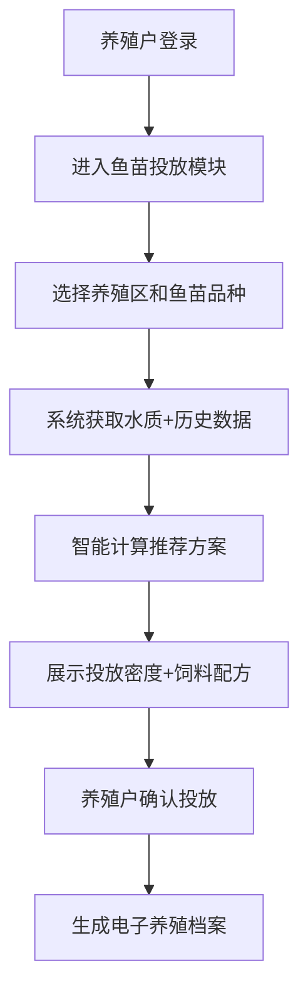
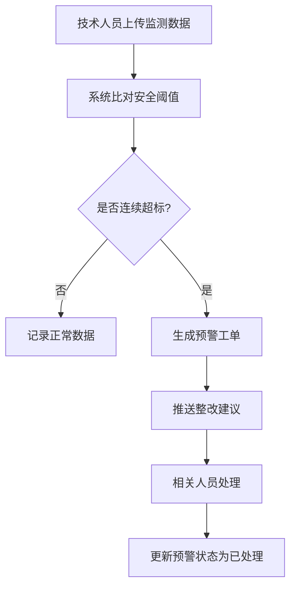
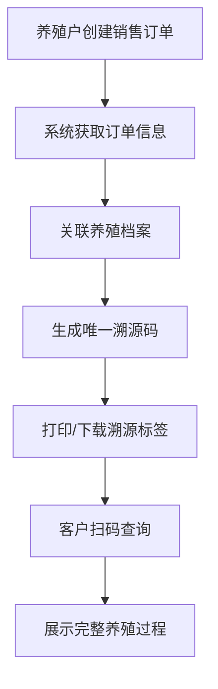

## 1. 产品概述

大型海洋牧场综合管理平台是一套服务于海洋养殖全产业链的智能管理系统，通过物联网、大数据和智能算法，实现养殖全过程数字化、智能化管理。平台服务于养殖户、技术人员、管理员和财务四类角色，覆盖鱼苗投放、水质监测、智能投喂、捕捞管理、产品溯源、财务分析等核心业务环节，帮助企业降本增效，提升产品质量和可追溯性。

## 2. 核心功能

### 2.1 用户角色

| 角色 | 注册方式 | 核心权限 |
|------|----------|----------|
| 养殖户 | 管理员创建 | 鱼苗投放、智能投喂设置、产品销售、养殖档案查看、溯源管理 |
| 技术人员 | 管理员创建 | 水质监测数据上传、预警处理、样品检测、整改建议查看 |
| 管理员 | 系统初始化 | 用户管理、养殖区管理、目标产值设置、病害防控规则配置、系统监控 |
| 财务 | 管理员创建 | 财务报表生成、成本核算、收入统计、损耗率分析 |

### 2.2 功能模块

1. **登录页**：角色选择登录、身份认证、权限控制
2. **仪表盘**：数据概览、关键指标展示、预警提醒、快捷操作入口
3. **鱼苗投放模块**：投放信息录入、智能推荐投放密度和饲料配方、电子养殖档案生成
4. **水质监测模块**：监测数据上传、阈值比对、超标预警、预警工单、整改建议
5. **智能投喂模块**：投喂计划设置、动态投喂量调整、投喂日志自动记录
6. **捕捞管理模块**：样品检测、产量预测、最佳捕捞窗口推荐、捕捞任务单生成
7. **养殖区管理模块**：区域配置、目标产值设置、病害防控规则、生长指标监控、区域锁定
8. **产品溯源模块**：订单管理、溯源码生成、溯源信息查询
9. **财务管理模块**：月度报表自动生成、产量/成本/收入/损耗率统计、对比分析
10. **消息通知模块**：实时消息推送、凭证下载、消息中心

### 2.3 页面详情

| 页面名称 | 模块名称 | 功能描述 |
|----------|----------|----------|
| 登录页 | 身份认证 | 账号密码登录、角色选择、验证码、记住登录状态 |
| 仪表盘 | 数据概览 | 关键指标卡片、实时数据图表、预警列表、快捷操作、今日待办 |
| 鱼苗投放 | 投放管理 | 投放信息表单、智能推荐算法展示、投放密度和饲料配方推荐、确认投放、养殖档案生成下载 |
| 水质监测 | 监测数据 | 数据上传表单、历史数据列表、阈值配置、超标标记、数据趋势图表 |
| 预警管理 | 预警工单 | 预警列表、预警详情、整改建议、处理状态跟踪、处理记录 |
| 智能投喂 | 投喂计划 | 投喂计划配置、投喂量调整规则、投喂日志列表、投喂日历 |
| 捕捞管理 | 捕捞任务 | 样品检测录入、产量预测模型、捕捞窗口推荐、任务单生成下载 |
| 养殖区管理 | 区域配置 | 区域列表、区域详情、目标产值设置、防控规则配置、生长指标监控、区域状态管理 |
| 产品溯源 | 订单溯源 | 订单列表、溯源码生成、溯源信息展示、扫码预览 |
| 财务报表 | 统计分析 | 月度报表、多维度对比图表、导出功能、推送记录 |
| 消息中心 | 通知管理 | 消息列表、消息详情、凭证下载、已读未读管理 |
| 用户管理 | 账号管理 | 用户列表、角色分配、权限配置、用户状态管理 |

## 3. 核心流程

### 3.1 鱼苗投放流程

养殖户登录后进入鱼苗投放模块，选择养殖区并录入鱼苗品种、数量等信息，系统根据该区域实时水质数据（温度、盐度、溶氧）和历史死亡率数据，通过智能算法计算推荐最佳投放密度和饲料配方，养殖户确认后生成电子养殖档案并完成投放。

### 3.2 水质监测预警流程

技术人员每日上传水质监测数据，系统实时比对预设安全阈值，如发现连续超标则自动生成预警工单并推送整改建议，相关人员处理后更新预警状态。

### 3.3 产品溯源流程

养殖户在线销售产品时，系统自动获取订单信息并生成唯一溯源码，客户通过扫码可查看该批次产品从鱼苗投放到捕捞销售的全过程养殖记录。

## 4. 用户界面设计

### 4.1 设计风格

- **设计主题**：海洋科技风，以深邃的海洋蓝色为主色调，体现海洋牧场的行业特性和科技感
- **主色调**：深海蓝 `#0A2463`，辅助色：青绿 `#3E92CC`，强调色：珊瑚橙 `#F46036`
- **字体**：展示字体使用 Cormorant Garamond（优雅高端），正文字体使用 Noto Sans SC（清晰易读）
- **卡片设计**：圆角卡片，细腻阴影，玻璃态效果增强层次感
- **布局**：左侧导航栏+顶部状态栏+主内容区的经典企业级管理平台布局
- **图标**：使用 lucide-react 图标库，线性风格，统一 24px 尺寸

### 4.2 页面设计概述

| 页面名称 | 模块名称 | UI 元素 |
|----------|----------|----------|
| 登录页 | 身份认证 | 渐变背景（海洋蓝到青绿）、居中卡片、波浪装饰元素、动态浮标动画 |
| 仪表盘 | 数据概览 | 4列指标卡片带图标、面积趋势图、预警列表带状态色标、快捷操作入口网格 |
| 鱼苗投放 | 投放管理 | 多步骤表单、智能推荐结果高亮卡片、水质数据雷达图、档案预览 |
| 水质监测 | 监测数据 | 数据表格带条件格式、实时数据折线图、阈值参考线、上传表单弹窗 |
| 预警管理 | 预警工单 | 预警卡片按严重程度着色、时间线处理记录、整改建议富文本展示 |
| 智能投喂 | 投喂计划 | 日历视图、投喂量柱状图、计划配置表单、日志时间轴 |
| 捕捞管理 | 捕捞任务 | 产量预测曲线、捕捞窗口高亮区间、任务单PDF预览、样品检测表单 |
| 养殖区管理 | 区域配置 | 区域卡片网格（状态色标区分）、指标趋势对比、规则配置抽屉 |
| 产品溯源 | 订单溯源 | 订单卡片、溯源码展示、溯源时间轴、手机端预览 |
| 财务报表 | 统计分析 | 多标签报表、柱状对比图、饼图占比分析、导出按钮组 |
| 消息中心 | 通知管理 | 消息列表按类型分组、未读红点标记、详情侧边抽屉、凭证下载 |

### 4.3 响应式设计

- **桌面优先**：针对1280px及以上屏幕优化，支持1920px大屏自适应
- **平板适配**：768px-1024px，导航栏折叠为图标模式，卡片布局自适应
- **手机适配**：375px-767px，底部导航，单列卡片布局，表单组件优化触控
- **触控优化**：按钮最小高度44px，合理间距，支持手势操作

### 4.4 交互与动画

- **页面入场**：主内容区渐入+轻微上浮，卡片依次错位延迟出现
- **数据加载**：骨架屏占位，内容淡入过渡
- **悬浮效果**：卡片悬浮时轻微上浮+阴影加深，按钮颜色渐变
- **预警动画**：高等级预警脉冲呼吸效果，吸引注意力
- **图表动画**：数据加载时曲线从0到实际值平滑绘制
- **反馈**：操作成功/失败Toast提示，表单校验实时反馈
