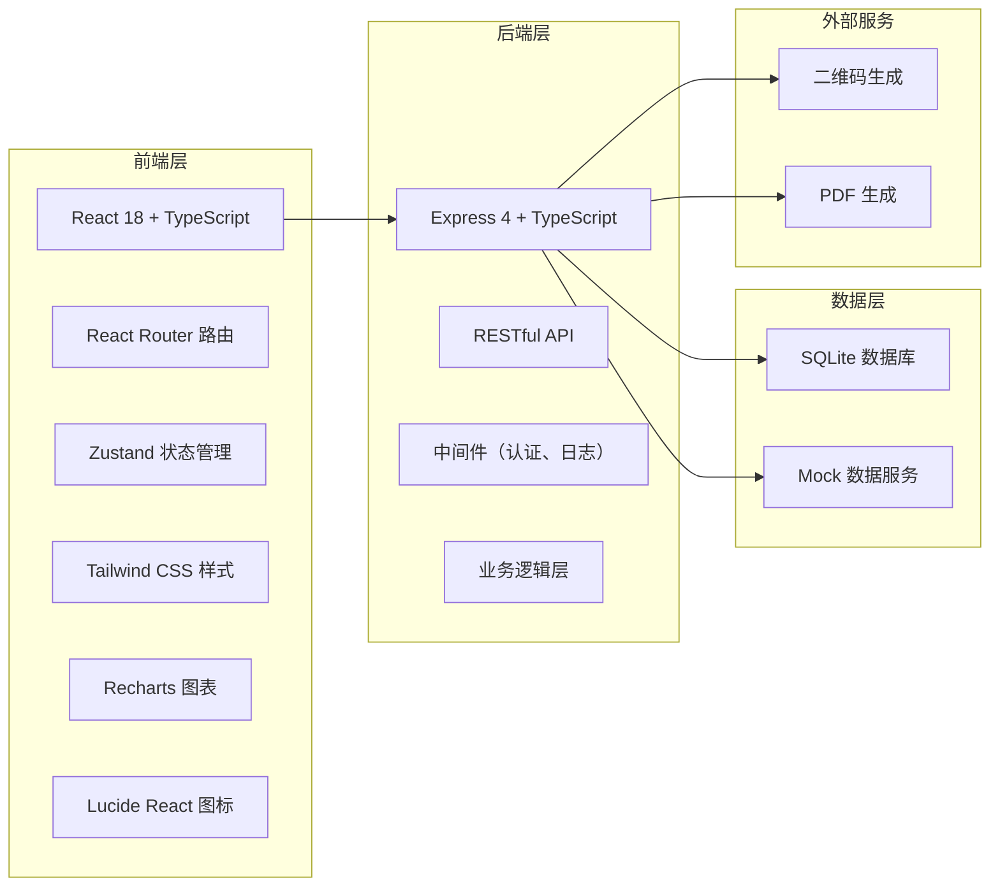
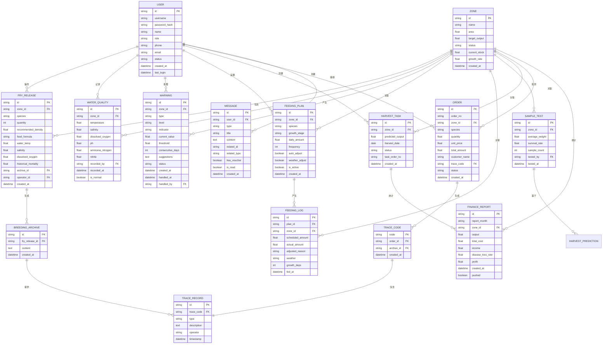

## 1. 架构设计



## 2. 技术描述

- **前端**：React@18 + TypeScript + Vite
- **UI框架**：TailwindCSS@3
- **状态管理**：Zustand
- **路由管理**：React Router DOM@6
- **图表库**：Recharts
- **图标库**：Lucide React
- **初始化工具**：vite-init
- **后端**：Express@4 + TypeScript
- **数据库**：SQLite（轻量级，便于Demo展示）
- **二维码**：qrcode 库
- **PDF生成**：jspdf 库

## 3. 路由定义

| 路由路径 | 页面名称 | 权限角色 |
|----------|----------|----------|
| `/login` | 登录页 | 所有 |
| `/dashboard` | 仪表盘 | 所有登录用户 |
| `/fry-release` | 鱼苗投放 | 养殖户、管理员 |
| `/water-quality` | 水质监测 | 技术人员、管理员 |
| `/warning` | 预警管理 | 技术人员、管理员 |
| `/feeding` | 智能投喂 | 养殖户、管理员 |
| `/harvest` | 捕捞管理 | 养殖户、管理员 |
| `/zone` | 养殖区管理 | 管理员 |
| `/traceability` | 产品溯源 | 养殖户、管理员 |
| `/finance` | 财务报表 | 财务、管理员 |
| `/messages` | 消息中心 | 所有登录用户 |
| `/users` | 用户管理 | 管理员 |
| `/trace/:code` | 溯源查询页（公开） | 公开访问 |

## 4. API 定义

### 4.1 认证相关

```typescript
// 登录请求
interface LoginRequest {
  username: string;
  password: string;
  role: 'farmer' | 'technician' | 'admin' | 'finance';
}

// 登录响应
interface LoginResponse {
  token: string;
  user: {
    id: string;
    username: string;
    role: string;
    name: string;
  };
}

// POST /api/auth/login
```

### 4.2 养殖区相关

```typescript
interface Zone {
  id: string;
  name: string;
  area: number;
  targetOutput: number;
  status: 'normal' | 'warning' | 'locked';
  currentStock: number;
  growthRate: number;
  diseaseControlRules: DiseaseRule[];
  createdAt: string;
}

interface DiseaseRule {
  id: string;
  indicator: string;
  threshold: number;
  action: 'notify' | 'lock';
}

// GET /api/zones
// POST /api/zones
// PUT /api/zones/:id
// GET /api/zones/:id
```

### 4.3 鱼苗投放相关

```typescript
interface FryRelease {
  id: string;
  zoneId: string;
  zoneName: string;
  species: string;
  quantity: number;
  recommendedDensity: number;
  feedFormula: string;
  waterTemp: number;
  salinity: number;
  dissolvedOxygen: number;
  historicalMortality: number;
  archiveId: string;
  createdAt: string;
  operator: string;
}

interface RecommendRequest {
  zoneId: string;
  species: string;
}

interface RecommendResponse {
  recommendedDensity: number;
  feedFormula: string;
  maxQuantity: number;
  confidence: number;
  factors: {
    name: string;
    value: number;
    weight: number;
  }[];
}

// POST /api/fry-release/recommend
// POST /api/fry-release
// GET /api/fry-release
// GET /api/fry-release/:id/archive
```

### 4.4 水质监测相关

```typescript
interface WaterQuality {
  id: string;
  zoneId: string;
  zoneName: string;
  temperature: number;
  salinity: number;
  dissolvedOxygen: number;
  ph: number;
  ammoniaNitrogen: number;
  nitrite: number;
  recordedBy: string;
  recordedAt: string;
  isNormal: boolean;
  abnormalItems: string[];
}

interface ThresholdConfig {
  indicator: string;
  min: number;
  max: number;
  unit: string;
}

// POST /api/water-quality
// GET /api/water-quality
// GET /api/water-quality/thresholds
// PUT /api/water-quality/thresholds
```

### 4.5 预警相关

```typescript
interface Warning {
  id: string;
  zoneId: string;
  zoneName: string;
  type: 'water_quality' | 'growth' | 'disease';
  level: 'low' | 'medium' | 'high';
  indicator: string;
  currentValue: number;
  threshold: number;
  consecutiveDays: number;
  suggestions: string[];
  status: 'pending' | 'processing' | 'resolved';
  createdAt: string;
  handledAt?: string;
  handledBy?: string;
  handleNote?: string;
}

// GET /api/warnings
// PUT /api/warnings/:id/handle
// GET /api/warnings/:id
```

### 4.6 投喂相关

```typescript
interface FeedingPlan {
  id: string;
  zoneId: string;
  zoneName: string;
  species: string;
  growthStage: string;
  dailyAmount: number;
  frequency: number;
  autoAdjust: boolean;
  weatherAdjust: boolean;
  isActive: boolean;
  createdAt: string;
}

interface FeedingLog {
  id: string;
  planId: string;
  zoneId: string;
  zoneName: string;
  scheduledAmount: number;
  actualAmount: number;
  adjustedReason: string;
  weather: string;
  growthDays: number;
  fedAt: string;
}

// GET /api/feeding/plans
// POST /api/feeding/plans
// PUT /api/feeding/plans/:id
// GET /api/feeding/logs
```

### 4.7 捕捞相关

```typescript
interface SampleTest {
  id: string;
  zoneId: string;
  zoneName: string;
  averageWeight: number;
  survivalRate: number;
  sampleCount: number;
  testedBy: string;
  testedAt: string;
}

interface HarvestPrediction {
  zoneId: string;
  zoneName: string;
  estimatedTotal: number;
  bestHarvestWindow: {
    start: string;
    end: string;
    reason: string;
  };
  priceForecast: number;
  confidence: number;
}

interface HarvestTask {
  id: string;
  zoneId: string;
  zoneName: string;
  predictedOutput: number;
  harvestDate: string;
  status: 'pending' | 'in_progress' | 'completed';
  taskOrderNo: string;
  createdAt: string;
}

// POST /api/harvest/sample
// GET /api/harvest/predict/:zoneId
// POST /api/harvest/task
// GET /api/harvest/tasks
// GET /api/harvest/tasks/:id/pdf
```

### 4.8 产品溯源相关

```typescript
interface Order {
  id: string;
  orderNo: string;
  zoneId: string;
  zoneName: string;
  species: string;
  quantity: number;
  unitPrice: number;
  totalAmount: number;
  customerName: string;
  traceCode: string;
  status: 'pending' | 'shipped' | 'completed';
  createdAt: string;
}

interface TraceRecord {
  type: string;
  description: string;
  operator: string;
  timestamp: string;
  data: any;
}

// GET /api/orders
// POST /api/orders
// GET /api/trace/:code
```

### 4.9 财务相关

```typescript
interface FinanceReport {
  id: string;
  reportMonth: string;
  zoneId: string;
  zoneName: string;
  output: number;
  cost: {
    fry: number;
    feed: number;
    labor: number;
    other: number;
  };
  income: number;
  diseaseLossRate: number;
  profit: number;
  comparedLastMonth: {
    output: number;
    cost: number;
    income: number;
    profit: number;
  };
  createdAt: string;
  pushed: boolean;
}

// GET /api/finance/reports
// GET /api/finance/reports/:id
// POST /api/finance/reports/generate
```

### 4.10 消息通知相关

```typescript
interface Message {
  id: string;
  userId: string;
  type: 'fry_release' | 'warning' | 'harvest' | 'sale' | 'system';
  title: string;
  content: string;
  relatedId: string;
  relatedType: string;
  hasVoucher: boolean;
  voucherUrl?: string;
  isRead: boolean;
  createdAt: string;
}

// GET /api/messages
// PUT /api/messages/:id/read
// GET /api/messages/:id/voucher
```

### 4.11 用户管理相关

```typescript
interface User {
  id: string;
  username: string;
  name: string;
  role: 'farmer' | 'technician' | 'admin' | 'finance';
  phone: string;
  email: string;
  status: 'active' | 'inactive';
  createdAt: string;
  lastLogin?: string;
}

// GET /api/users
// POST /api/users
// PUT /api/users/:id
// DELETE /api/users/:id
```

## 5. 数据模型

### 5.1 ER 图



### 5.2 DDL 语句

```sql
-- 用户表
CREATE TABLE users (
  id TEXT PRIMARY KEY,
  username TEXT UNIQUE NOT NULL,
  password_hash TEXT NOT NULL,
  name TEXT NOT NULL,
  role TEXT NOT NULL CHECK(role IN ('farmer', 'technician', 'admin', 'finance')),
  phone TEXT,
  email TEXT,
  status TEXT NOT NULL DEFAULT 'active',
  created_at DATETIME DEFAULT CURRENT_TIMESTAMP,
  last_login DATETIME
);

-- 养殖区表
CREATE TABLE zones (
  id TEXT PRIMARY KEY,
  name TEXT NOT NULL,
  area REAL NOT NULL,
  target_output REAL NOT NULL,
  status TEXT NOT NULL DEFAULT 'normal' CHECK(status IN ('normal', 'warning', 'locked')),
  current_stock REAL DEFAULT 0,
  growth_rate REAL DEFAULT 0,
  created_at DATETIME DEFAULT CURRENT_TIMESTAMP
);

-- 病害防控规则表
CREATE TABLE disease_rules (
  id TEXT PRIMARY KEY,
  zone_id TEXT NOT NULL,
  indicator TEXT NOT NULL,
  threshold REAL NOT NULL,
  action TEXT NOT NULL CHECK(action IN ('notify', 'lock')),
  created_at DATETIME DEFAULT CURRENT_TIMESTAMP,
  FOREIGN KEY (zone_id) REFERENCES zones(id)
);

-- 鱼苗投放表
CREATE TABLE fry_releases (
  id TEXT PRIMARY KEY,
  zone_id TEXT NOT NULL,
  zone_name TEXT NOT NULL,
  species TEXT NOT NULL,
  quantity INTEGER NOT NULL,
  recommended_density REAL NOT NULL,
  feed_formula TEXT NOT NULL,
  water_temp REAL NOT NULL,
  salinity REAL NOT NULL,
  dissolved_oxygen REAL NOT NULL,
  historical_mortality REAL NOT NULL,
  archive_id TEXT,
  operator TEXT NOT NULL,
  created_at DATETIME DEFAULT CURRENT_TIMESTAMP,
  FOREIGN KEY (zone_id) REFERENCES zones(id)
);

-- 养殖档案表
CREATE TABLE breeding_archives (
  id TEXT PRIMARY KEY,
  fry_release_id TEXT NOT NULL,
  content TEXT NOT NULL,
  created_at DATETIME DEFAULT CURRENT_TIMESTAMP,
  FOREIGN KEY (fry_release_id) REFERENCES fry_releases(id)
);

-- 水质监测表
CREATE TABLE water_quality (
  id TEXT PRIMARY KEY,
  zone_id TEXT NOT NULL,
  zone_name TEXT NOT NULL,
  temperature REAL NOT NULL,
  salinity REAL NOT NULL,
  dissolved_oxygen REAL NOT NULL,
  ph REAL NOT NULL,
  ammonia_nitrogen REAL NOT NULL,
  nitrite REAL NOT NULL,
  recorded_by TEXT NOT NULL,
  recorded_at DATETIME DEFAULT CURRENT_TIMESTAMP,
  is_normal BOOLEAN DEFAULT 1,
  abnormal_items TEXT,
  FOREIGN KEY (zone_id) REFERENCES zones(id)
);

-- 预警表
CREATE TABLE warnings (
  id TEXT PRIMARY KEY,
  zone_id TEXT NOT NULL,
  zone_name TEXT NOT NULL,
  type TEXT NOT NULL CHECK(type IN ('water_quality', 'growth', 'disease')),
  level TEXT NOT NULL CHECK(level IN ('low', 'medium', 'high')),
  indicator TEXT NOT NULL,
  current_value REAL NOT NULL,
  threshold REAL NOT NULL,
  consecutive_days INTEGER NOT NULL DEFAULT 1,
  suggestions TEXT NOT NULL,
  status TEXT NOT NULL DEFAULT 'pending' CHECK(status IN ('pending', 'processing', 'resolved')),
  created_at DATETIME DEFAULT CURRENT_TIMESTAMP,
  handled_at DATETIME,
  handled_by TEXT,
  handle_note TEXT,
  FOREIGN KEY (zone_id) REFERENCES zones(id)
);

-- 投喂计划表
CREATE TABLE feeding_plans (
  id TEXT PRIMARY KEY,
  zone_id TEXT NOT NULL,
  zone_name TEXT NOT NULL,
  species TEXT NOT NULL,
  growth_stage TEXT NOT NULL,
  daily_amount REAL NOT NULL,
  frequency INTEGER NOT NULL,
  auto_adjust BOOLEAN DEFAULT 1,
  weather_adjust BOOLEAN DEFAULT 1,
  is_active BOOLEAN DEFAULT 1,
  created_at DATETIME DEFAULT CURRENT_TIMESTAMP,
  FOREIGN KEY (zone_id) REFERENCES zones(id)
);

-- 投喂日志表
CREATE TABLE feeding_logs (
  id TEXT PRIMARY KEY,
  plan_id TEXT NOT NULL,
  zone_id TEXT NOT NULL,
  zone_name TEXT NOT NULL,
  scheduled_amount REAL NOT NULL,
  actual_amount REAL NOT NULL,
  adjusted_reason TEXT,
  weather TEXT NOT NULL,
  growth_days INTEGER NOT NULL,
  fed_at DATETIME DEFAULT CURRENT_TIMESTAMP,
  FOREIGN KEY (plan_id) REFERENCES feeding_plans(id),
  FOREIGN KEY (zone_id) REFERENCES zones(id)
);

-- 样品检测表
CREATE TABLE sample_tests (
  id TEXT PRIMARY KEY,
  zone_id TEXT NOT NULL,
  zone_name TEXT NOT NULL,
  average_weight REAL NOT NULL,
  survival_rate REAL NOT NULL,
  sample_count INTEGER NOT NULL,
  tested_by TEXT NOT NULL,
  tested_at DATETIME DEFAULT CURRENT_TIMESTAMP,
  FOREIGN KEY (zone_id) REFERENCES zones(id)
);

-- 捕捞任务表
CREATE TABLE harvest_tasks (
  id TEXT PRIMARY KEY,
  zone_id TEXT NOT NULL,
  zone_name TEXT NOT NULL,
  predicted_output REAL NOT NULL,
  harvest_date DATE NOT NULL,
  status TEXT NOT NULL DEFAULT 'pending' CHECK(status IN ('pending', 'in_progress', 'completed')),
  task_order_no TEXT NOT NULL,
  created_at DATETIME DEFAULT CURRENT_TIMESTAMP,
  FOREIGN KEY (zone_id) REFERENCES zones(id)
);

-- 订单表
CREATE TABLE orders (
  id TEXT PRIMARY KEY,
  order_no TEXT NOT NULL,
  zone_id TEXT NOT NULL,
  zone_name TEXT NOT NULL,
  species TEXT NOT NULL,
  quantity REAL NOT NULL,
  unit_price REAL NOT NULL,
  total_amount REAL NOT NULL,
  customer_name TEXT NOT NULL,
  trace_code TEXT,
  status TEXT NOT NULL DEFAULT 'pending' CHECK(status IN ('pending', 'shipped', 'completed')),
  created_at DATETIME DEFAULT CURRENT_TIMESTAMP,
  FOREIGN KEY (zone_id) REFERENCES zones(id)
);

-- 溯源码表
CREATE TABLE trace_codes (
  code TEXT PRIMARY KEY,
  order_id TEXT NOT NULL,
  archive_id TEXT NOT NULL,
  created_at DATETIME DEFAULT CURRENT_TIMESTAMP,
  FOREIGN KEY (order_id) REFERENCES orders(id)
);

-- 财务报表表
CREATE TABLE finance_reports (
  id TEXT PRIMARY KEY,
  report_month TEXT NOT NULL,
  zone_id TEXT NOT NULL,
  zone_name TEXT NOT NULL,
  output REAL NOT NULL,
  fry_cost REAL NOT NULL DEFAULT 0,
  feed_cost REAL NOT NULL DEFAULT 0,
  labor_cost REAL NOT NULL DEFAULT 0,
  other_cost REAL NOT NULL DEFAULT 0,
  income REAL NOT NULL,
  disease_loss_rate REAL NOT NULL,
  profit REAL NOT NULL,
  output_change REAL,
  cost_change REAL,
  income_change REAL,
  profit_change REAL,
  created_at DATETIME DEFAULT CURRENT_TIMESTAMP,
  pushed BOOLEAN DEFAULT 0,
  FOREIGN KEY (zone_id) REFERENCES zones(id)
);

-- 消息表
CREATE TABLE messages (
  id TEXT PRIMARY KEY,
  user_id TEXT NOT NULL,
  type TEXT NOT NULL CHECK(type IN ('fry_release', 'warning', 'harvest', 'sale', 'system')),
  title TEXT NOT NULL,
  content TEXT NOT NULL,
  related_id TEXT,
  related_type TEXT,
  has_voucher BOOLEAN DEFAULT 0,
  voucher_url TEXT,
  is_read BOOLEAN DEFAULT 0,
  created_at DATETIME DEFAULT CURRENT_TIMESTAMP,
  FOREIGN KEY (user_id) REFERENCES users(id)
);

-- 水质阈值配置表
CREATE TABLE threshold_configs (
  id TEXT PRIMARY KEY,
  indicator TEXT UNIQUE NOT NULL,
  min REAL NOT NULL,
  max REAL NOT NULL,
  unit TEXT NOT NULL
);

-- 初始化默认阈值数据
INSERT INTO threshold_configs (indicator, min, max, unit) VALUES
('temperature', 18, 28, '°C'),
('salinity', 20, 32, '‰'),
('dissolved_oxygen', 5, 12, 'mg/L'),
('ph', 7.0, 8.5, ''),
('ammonia_nitrogen', 0, 0.5, 'mg/L'),
('nitrite', 0, 0.2, 'mg/L');

-- 初始化默认用户
INSERT INTO users (id, username, password_hash, name, role, phone, email) VALUES
('admin001', 'admin', 'admin123', '系统管理员', 'admin', '13800138000', 'admin@oceanfarm.com'),
('farmer001', 'farmer', 'farmer123', '李养殖', 'farmer', '13800138001', 'farmer@oceanfarm.com'),
('tech001', 'technician', 'tech123', '王技术', 'technician', '13800138002', 'tech@oceanfarm.com'),
('finance001', 'finance', 'finance123', '张财务', 'finance', '13800138003', 'finance@oceanfarm.com');

-- 初始化默认养殖区
INSERT INTO zones (id, name, area, target_output, status, current_stock, growth_rate) VALUES
('zone001', 'A区 - 近海养殖区', 5000, 50000, 'normal', 35000, 0.85),
('zone002', 'B区 - 深海网箱区', 8000, 80000, 'normal', 62000, 0.92),
('zone003', 'C区 - 贝藻混养区', 3000, 25000, 'warning', 18000, 0.68),
('zone004', 'D区 - 珍品养殖区', 2000, 30000, 'normal', 22000, 0.95);
```
